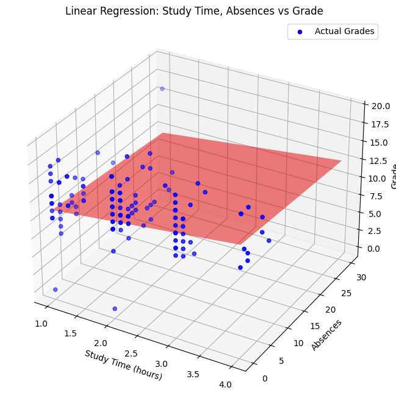

# Regression
Simple Linear Regression and Multiple Linear Regression

This project implements Simple and Multiple Linear Regression models using python from scratch without using predefined models.

# Linear Regression from Scratch: Predicting Housing Prices

This repository contains a simple linear regression model implemented from scratch using Python. The model predicts housing prices (`medv`) based on the average number of rooms per dwelling (`rm`) from the Boston Housing dataset.

## How Linear Regression Works

Linear regression is a method to model the relationship between a dependent variable (target) and one or more independent variables (features). The goal is to find the best-fitting line through the data points.

### Formula for Linear Regression

The equation for a simple linear regression model is:

\[ $\hat{y}$ = &theta;0 + &theta;1 x \]

Where:
- \($\hat{y}$\) is the predicted value.
- \(&theta;0\) is the intercept (the value of \($\hat{y}$\) when \(x = 0\)).
- \(&theta;1\) is the coefficient (the change in \($\hat{y}$\) for a one-unit change in \(x\)).
- \(x\) is the feature value.

### Steps to Fit the Model

1. **Add an Intercept Term**: We add a column of ones to the feature matrix to account for the intercept term.
2. **Calculate the Coefficients**: We use the normal equation to calculate the coefficients \(&theta;0\) and \(&theta;1\).

The normal equation is given by:

\[ &theta; = (XT X)-1 XT y \]

Where:
- \(X\) is the feature matrix (including the intercept term).
- \(y\) is the target vector.
- \(&theta;\) is the vector of coefficients \(&theta;0\) and \(&theta;1\).

## Diagram Explanation

### Diagram 1: Linear Regression Model

- The blue dots represent the actual data points.
- The red line is the best-fitting line found by the linear regression model.
- \(&theta;0\) is the y-intercept, and \(&theta;1\) is the slope of the line.

### Diagram 2: Calculating the Coefficients

1. **Feature Matrix**:
   
   
   - The first column is all ones (for the intercept term).
   - The second column contains the feature values.

3. **Target Vector \(y\)**:
   
     

5. **Normal Equation**:
   \[
   &theta; = (XT X)-1 XT y
   \]

# Multiple Linear Regression from Scratch: Predicting Student Grades

This repository contains a multiple linear regression model implemented from scratch in Python. The model predicts a student's final grade based on the amount of study time and the number of absences.

## How Multiple Linear Regression Works

Multiple linear regression extends simple linear regression by allowing us to use multiple input features to predict the target variable.

### Formula

The equation for a multiple linear regression model with two features is:

grade = \(&theta;0\) + \(&theta;1\) * studytime + \(&theta;2\) * absences

Where:
- `grade` is the predicted final grade.
- `theta_0` is the intercept (the value of `grade` when both `studytime` and `absences` are 0).
- `theta_1` is the coefficient for `studytime`.
- `theta_2` is the coefficient for `absences`.

### Steps to Fit the Model

1. **Prepare the Data**: Extract the features (study time and absences) and the target (final grade) from the dataset.
2. **Split the Data**: Divide the data into training and testing sets to evaluate the model's generalization ability.
3. **Add an Intercept Term**: Add a column of ones to the feature matrix to account for the intercept term.
4. **Calculate the Coefficients**: Use the normal equation to calculate the coefficients (`theta_0`, `theta_1`, and `theta_2`).

#### Diagram: Multiple Linear Regression with Two Features

*In this diagram:*
- The plane represents the predicted grades based on the two features (`studytime` and `absences`).
- The blue dots represent the actual student grades.
- The goal is to minimize the distance between the plane and the actual data points.

