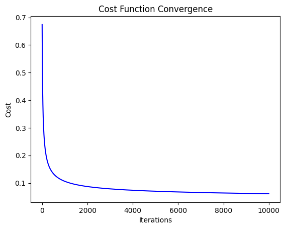

# Breast Cancer Prediction using Logistic Regression (From Scratch)

## Project Overview

This project implements logistic regression from scratch to classify whether a breast tumor is malignant or benign based on various features.

### 1. Dataset

The dataset used is the Breast Cancer Wisconsin (Diagnostic) dataset, which contains 30 features and a binary target variable (`0` for benign, `1` for malignant).

### 2. Mathematical Foundation

#### **Sigmoid Function (Logistic Function)**
The sigmoid function is used to map any real-valued number into a probability value between 0 and 1. It is defined as:

   σ(z) = $${1}\over{1 + e^{-z}}$$

Where \(z\) is a linear combination of input features:

z = &theta;0 + &theta;1 x1 + &theta;2 x2 + ... + &theta;n xn

#### **Hypothesis Function**
The hypothesis function for logistic regression is defined as:

h&theta;(x) = σ(&theta;T x) = $${1}\over{1 + e^{-\theta^T x}}$$

Where:
- &theta; is the vector of parameters (weights).
- \(x\) is the vector of input features.

This function outputs a value between 0 and 1, which can be interpreted as the probability that the given input belongs to the positive class (malignant in this case).

#### **Cost Function**
The cost function for logistic regression is based on the concept of maximum likelihood estimation. The goal is to minimize the error between the predicted values and the actual labels. The cost function is defined as:

\[
J(&theta;) = $$-{1}\over{m}$$ $$\sum_{i=1}^{m} \left[ y^{(i)} \log(h_\theta(x^{(i)})) + (1 - y^{(i)}) \log(1 - h_\theta(x^{(i)})) \right]$$
\]

Where:
- m is the number of training examples.
- yi is the actual label for the i-th example.
- h&theta;xi is the predicted probability that the i-th example belongs to the positive class.

This cost function penalizes incorrect predictions more as they move further away from the actual labels.

#### **Gradient Descent**
To minimize the cost function, we use the gradient descent optimization algorithm. The update rule for the parameters is:

\[
$$\theta_j := \theta_j - \alpha \frac{\partial J(\theta)}{\partial \theta_j}$$
\]

Where:
- $$\(\alpha\)$$ is the learning rate.
- $$\(\frac{\partial J(\theta)}{\partial \theta_j}\)$$ is the partial derivative of the cost function with respect to parameter $$\(\theta_j\)$$.

Gradient descent iteratively updates the parameters in the direction that reduces the cost function, eventually converging to the optimal parameter values.

### 3. Implementation

The logistic regression model is implemented using Python, without relying on machine learning libraries like `scikit-learn`. Key components implemented include:
- Sigmoid Function
- Hypothesis Function
- Cost Function
- Gradient Descent Optimization
- Prediction Function

### 4. Model Evaluation

The model is evaluated using:
- **Accuracy:** The ratio of correctly predicted instances to the total instances.
- **Cost Function Convergence:** A plot showing the decrease in the cost function over iterations of gradient descent.

### 5. Visualization

A plot of the cost function over iterations is provided to show the convergence of the model. Additionally, the accuracy of the model on the test set is reported.

### 6. Conclusion

This project provides a deep understanding of how logistic regression works by implementing the algorithm from scratch. The implementation covers the mathematical foundation, algorithmic steps, and model evaluation, making it an educational and insightful project for anyone interested in understanding logistic regression in depth.
