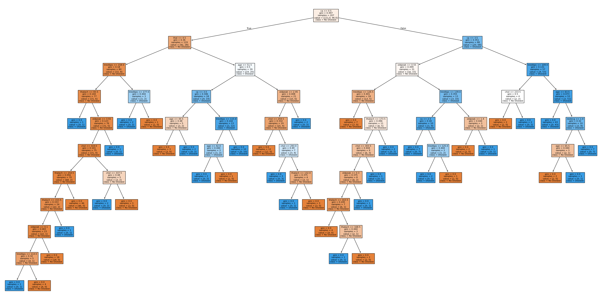
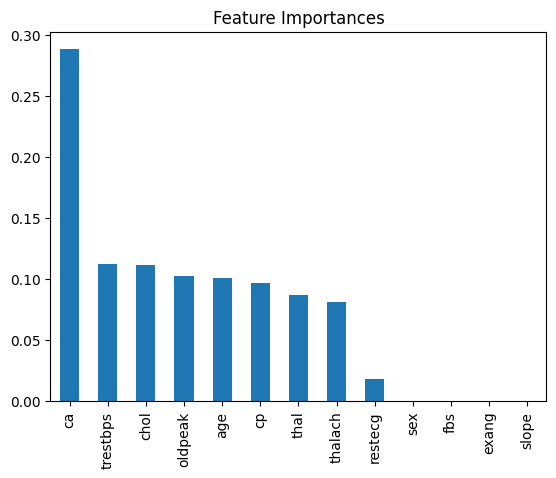

# Heart Disease Prediction Using Decision Trees

## Overview
This project aims to predict the presence of heart disease in patients using a Decision Tree classifier. The dataset used is the Heart Disease dataset from the UCI Machine Learning Repository. Decision trees are a popular machine learning algorithm, particularly for classification tasks, due to their simplicity and interpretability.

## What are Decision Trees?

A Decision Tree is a type of supervised learning algorithm that is primarily used for classification and regression tasks. It is a tree-like model where each internal node represents a decision based on the value of a specific feature, each branch represents the outcome of that decision, and each leaf node represents the final output or class label.

### How Decision Trees Work

1. **Splitting the Data:** The dataset is divided into smaller subsets based on the value of a feature that provides the best split. The goal is to create groups that are as homogeneous as possible with respect to the target variable. This is often done using measures like **Gini Impurity** or **Entropy**.

2. **Choosing the Best Split:** The algorithm evaluates all possible splits to find the one that results in the best separation of classes. The feature and threshold that minimize the impurity are chosen for the split.

3. **Recursive Process:** This process of splitting is repeated recursively for each child node until a stopping criterion is met, such as reaching a maximum depth or having all data points in a node belong to the same class.

4. **Leaf Nodes:** The nodes where the splitting process stops are called leaf nodes. Each leaf node corresponds to a final decision or prediction. In the case of classification, it represents the predicted class.

5. **Decision Path:** To make a prediction for a new sample, the model traverses the decision tree starting from the root node and follows the path determined by the sample's feature values until it reaches a leaf node.

Decision trees are intuitive and easy to interpret, making them a powerful tool for understanding the decision-making process of a model. However, they can be prone to overfitting, which can be mitigated by techniques such as pruning or using ensemble methods like Random Forest.

## Dataset Description
The Heart Disease dataset contains 303 samples with 14 attributes, which include:

- **Age:** Age in years.
- **Sex:** Gender of the patient (1 = male, 0 = female).
- **CP (Chest Pain Type):** Type of chest pain experienced.
- **Trestbps:** Resting blood pressure in mm Hg.
- **Chol:** Serum cholesterol in mg/dl.
- **Fbs:** Fasting blood sugar > 120 mg/dl (1 = true, 0 = false).
- **Restecg:** Resting electrocardiographic results.
- **Thalach:** Maximum heart rate achieved.
- **Exang:** Exercise-induced angina (1 = yes, 0 = no).
- **Oldpeak:** ST depression induced by exercise relative to rest.
- **Slope:** Slope of the peak exercise ST segment.
- **Ca:** Number of major vessels colored by fluoroscopy (0-3).
- **Thal:** Thalassemia (3 = normal, 6 = fixed defect, 7 = reversible defect).
- **Target:** Diagnosis of heart disease (0 = no disease, 1 = disease).

## Implementation

### 1. Data Preprocessing
- **Handling Missing Values:** Missing values were identified and removed.
- **Feature Selection:** All 13 features were considered.
- **Splitting the Data:** The data was split into training and testing sets with a 70-30 ratio.

### 2. Training the Decision Tree
A Decision Tree classifier was trained on the training set. The model was then evaluated on the test set to determine its accuracy.

### 3. Model Evaluation
The model's performance was evaluated using the following metrics:

- **Accuracy:** The overall correctness of the model.
- **Confusion Matrix:** To understand the distribution of true positives, true negatives, false positives, and false negatives.
- **Classification Report:** Including precision, recall, and F1-score for both classes.

### 4. Visualization
The trained decision tree was visualized to understand how the model makes decisions based on the input features. Additionally, feature importance was plotted to highlight which features were most influential in predicting heart disease.

### 5. Mathematical Foundation

#### Decision Tree Algorithm

A Decision Tree works by splitting the data into subsets based on the value of input features. Each node in the tree represents a feature, and each branch represents a decision rule. The process continues recursively until a stopping criterion is met (e.g., all data points in a node belong to the same class).

The algorithm uses a measure like **Gini Impurity** or **Entropy** to determine the best feature to split on. For binary classification, Gini Impurity is commonly used:

- **Gini Impurity**:  
\[ Gini(D) = 1 - \sum_{i=1}^{n} p_i^2 \]
Where \( p_i \) is the probability of class \( i \) in dataset \( D \).

#### Training Process

- **Step 1:** Start at the root node and calculate the Gini impurity for the entire dataset.
- **Step 2:** For each feature, calculate the Gini impurity for each possible split.
- **Step 3:** Choose the feature and split that result in the lowest Gini impurity.
- **Step 4:** Create child nodes for the split and repeat the process recursively.

#### Visualizing the Decision Tree

Below is an example of a decision tree structure:

In the diagram:
- Each node represents a feature used for splitting.
- The branches represent the decision rules.
- The leaf nodes represent the final classification.

#### Feature Importance

Feature importance was calculated to identify the most significant features in predicting heart disease. The higher the importance score, the more influential the feature.

## Conclusion
This project demonstrates the application of Decision Trees to predict heart disease. The simplicity of decision trees, combined with their interpretability, makes them a powerful tool in medical diagnosis and other fields.

## Next Steps
- **Pruning the Tree:** Implement tree pruning to avoid overfitting.
- **Ensemble Methods:** Explore Random Forest or Gradient Boosting for improved performance.

## References
- UCI Machine Learning Repository: [Heart Disease Dataset](https://archive.ics.uci.edu/ml/datasets/Heart+Disease)
- Scikit-learn Documentation: [Decision Trees](https://scikit-learn.org/stable/modules/tree.html)
